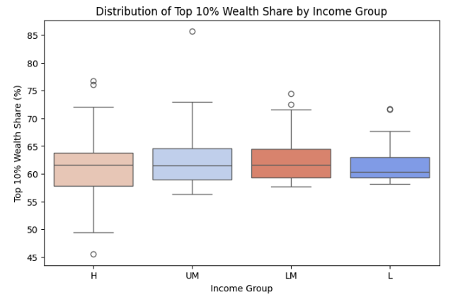
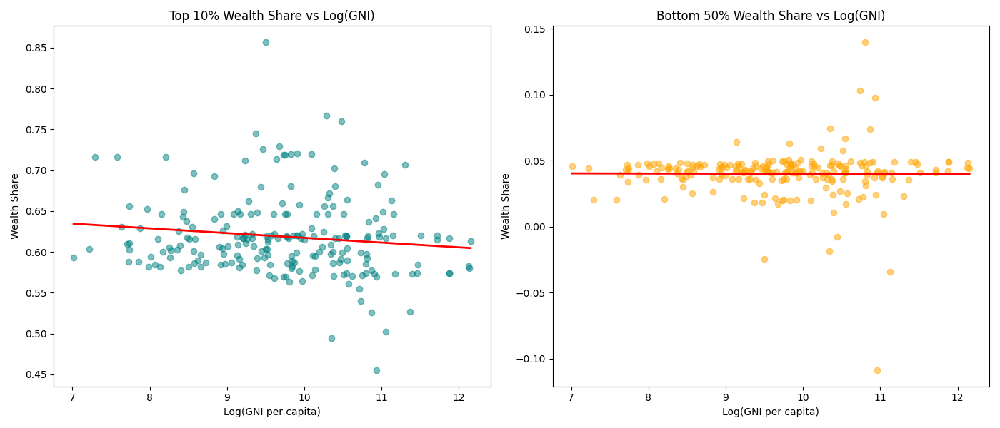
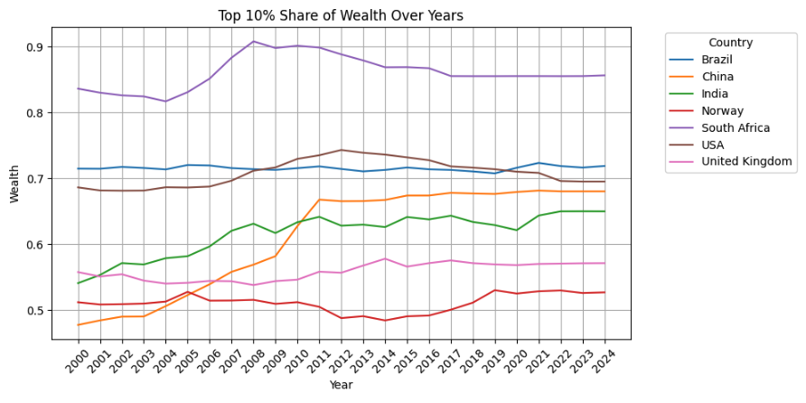
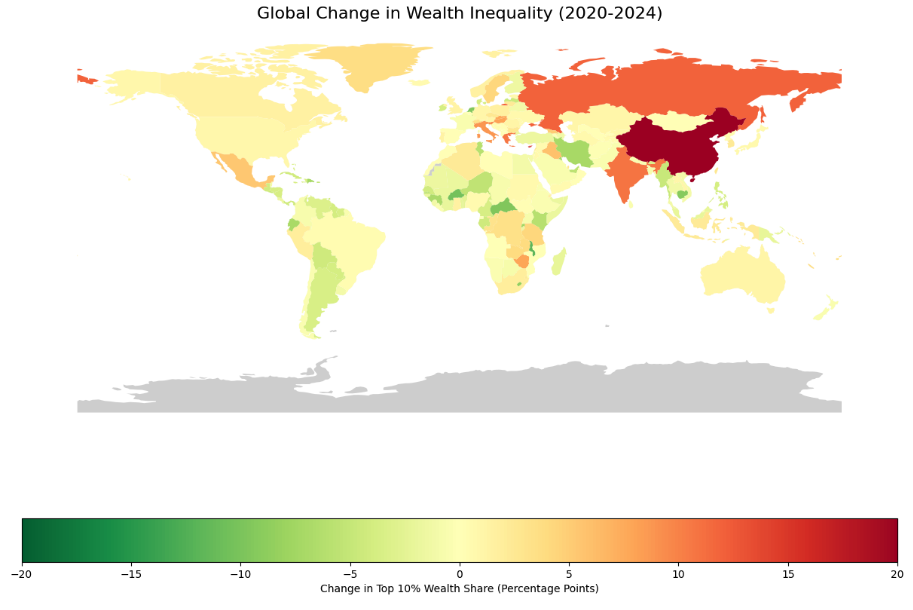

# Global Wealth Inequality: Structural Concentration & Asset Ownership (2020–2024)

### Purpose & Objective
This project focuses on **wealth inequality**—measured by asset concentration (Top 10% and Bottom 50% shares)—rather than income-based measures like the Gini coefficient. While the Gini provides a summary, wealth shares capture long-term structural disparities, elite accumulation, and post-COVID financial dynamics. By analyzing cross-country data from 2020–2024, this project examines whether systematic patterns emerge across income groups and regions.

### Key Questions and Findings
1. **Are there regional or structural patterns in global wealth inequality?**
   - **Finding:** Yes. Two distinct models emerge:
     - **The Elite Concentration Model:** Common in emerging markets (e.g., South Africa, Brazil, Mexico), where historical asset ownership patterns lead to Top 10% shares exceeding 70–80%.
     - **The Financialized Debt Model:** Found in advanced economies (e.g., USA, Canada, Sweden). While these nations have advanced markets, high levels of household indebtedness (mortgages, student loans) push the net wealth of the Bottom 50% into negative territory.

| Country                             | Top 10% Share of Wealth |
| ----------------------------------- | ----------------------- |
| Highly Financialized Economies      | ~57–70%                 |
| Nordic countries                    | ~50–68%                 |
| Emerging Asset-Growth Economies     | ~68—86%                    |

2. **Are there observable patterns in global wealth inequality across income groups?**
   - **Finding:** No. Descriptive statistics and ANOVA results show that the Top 10% own approximately **60–63% of total wealth across all income levels** (High, Upper-Middle, Lower-Middle, and Low). There is no significant gradient as countries get richer; wealth exclusion at the bottom (Bottom 50% share ~4%) remains a persistent global feature.

3. **Does national income level (GNI per capita) predict wealth concentration?**
   - **Finding:** No. Regression analysis shows **no statistically significant relationship** between GNI per capita and wealth shares. High-income status does not guarantee equitable asset distribution; institutional and financial frameworks are far more influential.

4. **Has wealth inequality increased or decreased in the period 2020–2024?**
   - **Finding:** Wealth concentration remained **largely stable or slightly increased**. The magnitude of change was relatively uniform across different regions, suggesting that structural distributions are resistant to short-term global shocks.

### Future Considerations
- Investigate the specific composition of debt (e.g., consumer vs. education) in the "Financialized Debt Model" to understand barriers to long-term wealth building.
- Track asset types (real estate vs. financial assets) longitudinally to see how market volatility affects concentration at the relative top.
- Analyze the impact of regional tax and redistributive policies on the Bottom 50% wealth share.

### Takeaway
Wealth inequality is a **structurally embedded global phenomenon** that does not automatically diminish with growth or "development." This project highlights that addressing wealth concentration requires targeted interventions in asset distribution, debt restructuring, and the strengthening of institutions that facilitate broad-based ownership rather than simply relying on national income growth.

### Resources
- [World Inequality Database (WID)](https://wid.world/)
- [World Bank GNI per capita data](https://data.worldbank.org/indicator/NY.GNP.PCAP.CD)
- [World Bank Country Classifications](https://datahelpdesk.worldbank.org/knowledgebase/articles/378834-how-does-the-world-bank-classify-countries)
